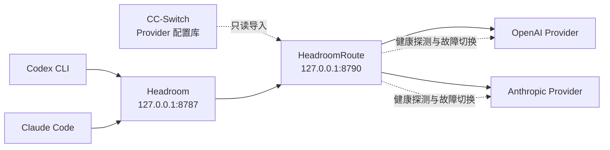

<div align="center">

# HeadroomRoute

**把 CC-Switch Provider、Codex、Claude Code 与 Headroom 收进一个 Windows 托盘。**

只读复用 CC-Switch Provider，统一交给 Headroom 省 Token，并在托盘中独立选路、监测和故障切换。

[](https://github.com/nizzo-dev/HeadroomRoute/releases/latest)
[](https://github.com/nizzo-dev/HeadroomRoute/releases)

[](LICENSE)

[快速开始](#快速开始) · [CC-Switch 集成](#cc-switch-在-headroomroute-中的作用) · [工作原理](#工作原理) · [更新](#软件更新) · [故障排查](#故障排查)

</div>

---

HeadroomRoute 是一个轻量、原生的 Windows 托盘路由器，面向同时使用 **Codex CLI、Claude Code、Headroom 或 CC-Switch** 的用户。核心、托盘和本地代理运行在同一个 Rust 进程中；没有 Electron，也不会捆绑或自动安装 Python 与 Headroom。

## 为什么使用 HeadroomRoute

| 能力 | 行为 |
| --- | --- |
| 双协议路由 | 同时代理 OpenAI Responses API 与 Anthropic Messages API |
| 独立 Provider | Codex 与 Claude 可分别选择上游，互不干扰 |
| 复用 CC-Switch | 从其数据库只读导入 Provider、鉴权和模型配置，无需维护第二份账号 |
| 自动故障切换 | 当前路由连续失败 3 次后，只切换到同协议且已验证健康的 Provider |
| 一键旁路 | Headroom 故障时可让两套 CLI 直接经过本地路由，保留 Provider 切换能力 |
| CLI 直连 | Codex 与 Claude 可分别跳过 HeadroomRoute，直接使用当前上游地址 |
| 外部 Headroom | 使用用户自行维护的 Python / Headroom 环境，不下载额外运行时 |
| 安全接管配置 | 修改 Codex、Claude 配置前创建备份，不在自身配置中保存 API Key |
| 可诊断 | 分别显示 Codex、Claude 的健康、延迟、HTTP 状态与恢复建议 |
| 可回滚更新 | 下载校验、设置备份、外部替换；新版本启动失败时恢复旧版本 |

它适合希望在一台 Windows 设备上，用一个托盘统一管理本地 AI CLI 路由的人。它不是云端控制台、账号同步服务或通用反向代理。

## 快速开始

### 前置环境

请先自行安装 Python 3.10 或更高版本，并准备 Headroom 0.34.0。默认检测路径为 `%USERPROFILE%\.headroom\venv\Scripts\python.exe`：

```powershell
python -m venv "$env:USERPROFILE\.headroom\venv"
& "$env:USERPROFILE\.headroom\venv\Scripts\python.exe" -m pip install "headroom-ai[code]==0.34.0"
```

如需使用其他虚拟环境，可从托盘选择 **维护与还原 → 选择 Headroom Python...**，验证通过后重新启动 HeadroomRoute。程序只检测该环境，不会安装或升级其中的任何内容。

### 推荐：正式安装

1. 从 [最新 Release](https://github.com/nizzo-dev/HeadroomRoute/releases/latest) 下载 `HeadroomRoute-*-windows-x64.zip`。
2. 解压 ZIP。
3. 在 PowerShell 中运行：

```powershell
.\Install.ps1 -StartNow
```

程序会安装到 `%LOCALAPPDATA%\HeadroomRoute` 并驻留通知区域。首次启动时，它会检测 Headroom 环境，并从 `%USERPROFILE%\.cc-switch\cc-switch.db` 只读发现 Codex 与 Claude Provider；没有 CC-Switch 时仍可读取两套 CLI 的现有配置。

首次检查发现 Headroom 或 Provider 缺失时，程序会直接显示对应的 PowerShell 安装命令或同步入口，不会自动安装运行时。

> Windows SmartScreen 可能提示未知发布者：当前 Release 尚未进行代码签名。请从本仓库 Release 下载，并使用同版本的 `SHA256SUMS.txt` 核验文件。

### 便携运行

也可以直接运行 ZIP 中的版本化 EXE。便携版拥有完整路由能力；确认软件更新后会自动安装到 `%LOCALAPPDATA%\HeadroomRoute` 并重启。

## 核心能力

### 一个托盘管理两套 CLI

- 分别查看 Codex、Claude 的当前 Provider、健康状态和延迟。
- 独立切换 OpenAI 与 Anthropic 上游。
- 从 Codex、Claude Code 和 CC-Switch 自动发现可用 Provider。
- 一键同步配置、立即检查上游或重启 Headroom。
- Headroom 异常时可一键旁路压缩层；CLI 仍通过 HeadroomRoute 使用当前 Provider。
- 开发调试时可分别让 Codex 或 Claude 直连当前上游；切换 Provider 时同步其标准地址、模型和凭据，退出后可由 CC-Switch 接管。
- CC-Switch Provider 或 CLI 路由配置变化时主动提醒，不静默切换 Provider。

### CC-Switch 在 HeadroomRoute 中的作用

CC-Switch 是 Provider 配置来源，HeadroomRoute 是运行时路由层；两者不是替代关系：

| 组件 | 职责 |
| --- | --- |
| CC-Switch | 保存 Codex / Claude Provider 的名称、上游地址、鉴权和模型设置 |
| HeadroomRoute | 只读导入这些 Provider，在托盘中独立选路、探测健康并执行故障切换 |
| Headroom | 处理 Codex / Claude 请求，压缩上下文以节省 Token |

具体行为：

- 启动或点击“同步 Codex + Claude / CC-Switch”时，重新读取 CC-Switch 数据库；不会写入数据库，也不会改变 CC-Switch 当前选中的 Provider。
- 同步前会备份 Codex / Claude 的原配置，再把两套 CLI 指向本机 Headroom；后续换 Provider 无需反复改 API 地址。
- CC-Switch 中每个有效的 Codex、Claude Provider 都会成为同协议的独立托盘路由；即使上游地址相同，也保留各自名称和身份。
- Codex 与 Claude 的选路互相独立，选择结果保存在 HeadroomRoute 自己的配置中。
- 切换到 CC-Switch Provider 时，同时同步其模型设置：Codex 的 `model`，以及 Claude 的主模型、默认模型和子代理模型；CLI 需重启后生效。
- Provider 凭据仅在运行时用于转发，不写入 HeadroomRoute 的 `config.json` 或诊断报告。CC-Switch 无需保持打开，只需数据库文件可读。

默认数据库路径是 `%USERPROFILE%\.cc-switch\cc-switch.db`；自定义位置可通过 `config.json` 的 `cc_switch_db` 指定。

### 保守的自动故障切换

自动切换默认关闭。启用后，HeadroomRoute 只在当前路由出现连续 3 次相关失败时行动，并且候选路由必须满足：

1. 与故障路由使用相同协议；
2. 已通过真实请求验证为健康；
3. 不是当前故障路由。

自动切换成功后，故障 Provider 会冷却 5 分钟，避免短暂恢复造成线路来回切换；托盘通知会说明协议、失败线路和切换目标。

只有明确影响当前路由的状态（`401`、`403`、`408`、`429`、`5xx`）会计入失败；普通请求错误（例如 `400`、`404`）不会触发切换。

在托盘中点击“配置故障转移策略...”即可可视化配置：

1. 选择 Codex 或 Claude，再选择源 Provider；
2. 开启“为此 Provider 使用自定义转移顺序”；
3. 从左侧加入允许转移的目标，并在右侧上移或下移调整优先级；
4. 保存后立即生效，无需重启。

关闭某个源 Provider 的自定义顺序时，恢复为从同协议健康 Provider 中选择评分最高者；开启自定义顺序但保持目标为空，则表示该源不允许自动转移。

高级用户仍可直接在 `config.json` 中编辑相同规则：

```json
{
  "failover_policy": {
    "openai": {
      "codex-primary-id": ["codex-backup-1-id", "codex-backup-2-id"]
    },
    "anthropic": {
      "claude-primary-id": ["claude-backup-id"]
    }
  }
}
```

- `openai` 对应 Codex，`anthropic` 对应 Claude；源和目标均填写稳定的 Provider ID。
- 已配置规则时严格按数组顺序选择首个健康目标，不会切换到名单外 Provider；空数组表示该源不允许自动转移。
- 某个源未配置规则时，保持兼容行为：从同协议健康 Provider 中选择评分最高者。
- 删除、不健康、处于冷却期、重复或跨协议的目标会被跳过。
- 在托盘“设置与诊断”中可复制 Provider ID 清单；手动编辑保存后点击“重新加载故障转移规则”，无需重启。

### 清晰的诊断

双击托盘图标可查看完整状态；“设置与诊断”菜单可以复制脱敏诊断报告。报告包含路由状态、延迟、HTTP 状态、最近错误和恢复建议，但不包含 API Key。

托盘状态和诊断报告还会从 Headroom 的本地 JSONL 日志累计展示原始与压缩后 Token、节省量、压缩率和已完成请求失败率；不会保存请求正文。

统计会注明是当前日志累计还是自最近一次清零起；清零只移动统计起点，不删除原始日志。当前 Headroom 日志没有可靠的协议字段，因此不会伪造 Codex / Claude 拆分数据。

## 工作原理



HeadroomRoute 从 CC-Switch 或现有 CLI 配置发现 Provider，把 Codex 与 Claude 的客户端地址指向本机 Headroom；Headroom 再把请求交给本地路由代理。路由代理根据协议选择对应 Provider，并持续记录真实请求与健康探测结果。

开发调试时，托盘可分别开启 Codex 或 Claude 的“直连当前上游”。直连会把对应 CLI 配置切换为所选 CC-Switch Provider 的标准配置、HTTPS 地址、模型和凭据，不经过 HeadroomRoute Agent；Codex 凭据写入 Codex 自己的 `auth.json`，Claude 凭据写入 Claude 的 `settings.json`，HeadroomRoute 的 `config.json` 和诊断报告不会保存凭据。直连模式下该协议不执行自动故障切换，切换 Provider 后需重启对应 CLI。正常退出时，直连协议会交还给 CC-Switch 当前 Provider；没有可用当前 Provider 时保留最近一次 HTTPS 直连配置。

默认端口：

| 服务 | 地址 |
| --- | --- |
| Headroom | `127.0.0.1:8787` |
| HeadroomRoute Agent | `127.0.0.1:8790` |

两个服务都只监听本机回环地址。

## 软件更新

可在 **设置与诊断 → 检查软件更新...** 中：

1. 检查 GitHub 最新正式版；
2. 查看版本、发布时间和完整 Release Notes；
3. 带进度下载，或随时取消；
4. 校验 ZIP 的 SHA-256；
5. 确认后重启并更新。

更新请求沿用 HeadroomRoute 的系统代理设置；连接中断时最多重试 3 次并保留临时分片供下次续传。仍然失败时可直接打开官方 Release 页面手动下载。

更新不会静默安装，也不会检查草稿或预发布版本。替换 EXE 前，安装脚本会备份 `config.json`、`status.json` 和旧程序；启动失败时自动恢复。外部 Python / Headroom 环境不会被更改。

默认启用每日更新提醒：启动后每天最多后台检查一次正式版本，只发送通知，不下载或安装；可在“设置与诊断”中关闭。

也可以从新 Release 解压后再次运行 `Install.ps1`，完成相同的原位升级。

## 托盘菜单速览

- **双击托盘图标**：查看完整状态。
- **切换 Codex / Claude 上游**：独立选择 Provider。
- **立即检查上游**：触发健康探测。
- **自动故障切换**：开启或关闭保守切换策略。
- **配置故障转移策略**：可视化选择允许目标并调整转移优先级。
- **打开 config.json（高级配置）**：手动编辑完整配置。
- **复制 Provider ID 清单**：复制名称与稳定 ID 的对照表。
- **重新加载故障转移规则**：保存配置后热加载，不重启代理。
- **旁路 Headroom（保留路由）**：临时跳过压缩层，直接使用本地路由代理。
- **Codex 直连当前上游**：Codex 跳过 Headroom 与 HeadroomRoute，使用当前 Provider 的标准配置和凭据。
- **Claude 直连当前上游**：Claude Code 跳过 Headroom 与 HeadroomRoute，使用当前 Provider 的标准配置和凭据。
- **同步 Codex + Claude / CC-Switch**：重新发现并写入路由配置。
- **重新检测 Headroom 环境**：验证 `headroom_python` 指向的外部环境。
- **选择 Headroom Python**：选择并验证自定义 `python.exe`，无需手改 JSON。
- **清零 Headroom 统计**：保存新的统计起点，不删除原始日志。
- **恢复原始配置**：恢复 HeadroomRoute 接管前的 CLI 配置。
- **完全卸载并还原**：还原配置并移除程序数据与启动项，不删除外部环境。

## 命令行

```text
HeadroomRoute.exe --doctor             输出脱敏诊断报告
HeadroomRoute.exe --configure          同步 Codex 与 Claude Code 路由配置
HeadroomRoute.exe --configure-claude   仅配置 Claude Code
HeadroomRouteCLI.exe claude [参数...]   通过确认悬浮窗启动 Claude Code CLI
HeadroomRouteCLI.exe codex [参数...]    通过确认悬浮窗启动 Codex CLI
HeadroomRoute.exe --approval-demo       启动后直接显示确认悬浮窗演示
HeadroomRoute.exe --restore            恢复原始 CLI 路由配置
HeadroomRoute.exe --check-runtime      检测外部 Headroom 环境
HeadroomRoute.exe --uninstall          还原配置并卸载
hr claude [参数...]                    通过确认悬浮窗启动 Claude Code CLI
hr codex [参数...]                     通过确认悬浮窗启动 Codex CLI
```

### CLI 确认悬浮窗

先启动 HeadroomRoute，再从终端使用 `hr` 快捷命令。正式安装会把 `%LOCALAPPDATA%\HeadroomRoute` 加入当前用户 PATH，并安装 `hr.cmd` 转发器；安装完成后请重新打开 CMD 或 PowerShell。wrapper 会保持在当前终端前台并保留真实终端交互；当 CLI 输出可识别的执行确认提示时，HeadroomRoute 会在当前终端所在显示器的顶部居中显示“拒绝/允许一次”窗口。窗口会展示操作、目录、原始提示和实时倒计时，30 秒无操作自动拒绝；托盘菜单中的“测试确认悬浮窗”可先查看效果。

例如：

```cmd
hr claude
hr codex --help
```

也可以直接调用安装目录中的完整入口：

```cmd
"%LOCALAPPDATA%\HeadroomRoute\HeadroomRouteCLI.exe" claude
"%LOCALAPPDATA%\HeadroomRoute\HeadroomRouteCLI.exe" codex --help
```

```powershell
hr claude
hr codex --help
```

PowerShell 也可以直接调用完整入口：

```powershell
& "$env:LOCALAPPDATA\HeadroomRoute\HeadroomRouteCLI.exe" claude
& "$env:LOCALAPPDATA\HeadroomRoute\HeadroomRouteCLI.exe" codex --help
```

等待悬浮窗决定期间，wrapper 会忽略终端键盘输入，避免终端答案和悬浮窗答案被重复写入；请直接点击“拒绝”或“允许一次”。CLI 退出会立即撤销其未处理请求。无法可靠识别的提示仍保留 CLI 原生交互。

`Ctrl+C` 会转发给 Codex 或 Claude。无论子 CLI 正常退出还是因中断返回非零状态，wrapper 都会先排空 ConPTY 输出，并恢复 CMD/PowerShell 的代码页、输入模式、光标及 VT 私有模式，再将退出码交还给终端。

需要保留原始 CLI 行为时，直接运行 `claude` 或 `codex` 即可；该功能不会自动替换全局命令。确认管道只在本机当前用户范围内工作，最多排队 8 个请求，不保存完整终端输出。

旧的 `HeadroomRoute.exe run ...` GUI 入口已停用，因为 CMD 不会等待 GUI 子系统进程，可能造成提示符提前返回和终端输入冲突；请统一使用 `hr`，或使用 `HeadroomRouteCLI.exe` 完整入口。

## 数据与隐私

数据目录：`%LOCALAPPDATA%\HeadroomRoute`

| 内容 | 位置或说明 |
| --- | --- |
| 用户设置 | `config.json` |
| 当前状态 | `status.json` |
| Headroom 日志 | `headroom.stdout.log`、`headroom.stderr.log` |
| 更新设置备份 | `update-settings-backup\` |
| 旧版本程序 | `HeadroomRoute.previous.exe` |

- HeadroomRoute 的配置文件不保存 Provider API Key。
- CC-Switch 数据库始终以只读方式打开；Provider 凭据不会复制进 HeadroomRoute 配置。直连模式会按 CLI 自身格式写入客户端配置，以便切换后独立运行并在退出时交还 CC-Switch。
- 诊断报告会脱敏敏感数据。
- 程序不会下载、安装或升级 Python 与 Headroom。
- 软件更新只在用户手动点击检查时访问 GitHub Releases。
- 卸载会先恢复 Codex 与 Claude Code 的原始配置。

## 故障排查

按以下顺序通常能最快定位问题：

1. 从托盘执行“立即检查上游”。
2. 查看完整状态中的 HTTP 状态和恢复建议。
3. 运行 `HeadroomRoute.exe --doctor` 或复制脱敏诊断报告。
4. 打开数据与日志目录检查 Headroom 错误日志。
5. Headroom 无法启动时，核对 `headroom_python`，再执行“重新检测 Headroom 环境”。

如果问题仍然存在，请提交 [Issue](https://github.com/nizzo-dev/HeadroomRoute/issues)，附上脱敏诊断报告、复现步骤和 Windows 版本。不要上传 API Key、完整个人配置或未经检查的日志。

## 从源码构建

要求：Windows x64、Rust stable。

```powershell
.\Build.ps1
```

构建脚本会依次执行检查、测试、真实隔离升级测试和 Release 构建，并在 `dist\` 生成：

```text
HeadroomRoute-<version>.exe
HeadroomRouteCLI-<version>.exe
hr.cmd (ZIP 内快捷入口)
HeadroomRoute-<version>-windows-x64.zip
HeadroomRoute-<version>-SHA256SUMS.txt
```

常用开发命令：

```powershell
cargo fmt -- --check
cargo clippy --all-targets -- -D warnings
cargo test
```

## 参与贡献

欢迎提交可复现的 Issue 和范围明确的 Pull Request。代码改动请包含与行为对应的测试，并确保格式化、Clippy、测试及 `Build.ps1` 全部通过。

## License

[MIT](LICENSE)
