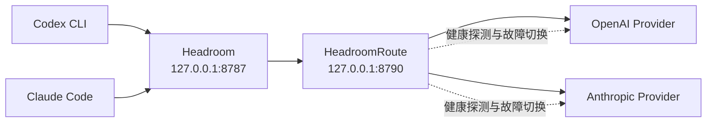

<div align="center">

# HeadroomRoute

**把 Codex、Claude Code 与多个 Provider 收进一个 Windows 托盘。**

自动接管本地路由，管理 Headroom，监测上游健康，并在故障时安全切换。

[](https://github.com/nizzo-dev/HeadroomRoute/releases/latest)
[](https://github.com/nizzo-dev/HeadroomRoute/releases)

[](LICENSE)

[快速开始](#快速开始) · [核心能力](#核心能力) · [工作原理](#工作原理) · [更新](#软件更新) · [故障排查](#故障排查)

</div>

---

HeadroomRoute 是一个轻量、原生的 Windows 托盘路由器，面向同时使用 **Codex CLI、Claude Code、Headroom 或 CC-Switch** 的用户。核心、托盘和本地代理运行在同一个 Rust 进程中；没有 Electron，也不要求预装 Python 或常驻桌面运行时。

## 为什么使用 HeadroomRoute

| 能力 | 行为 |
| --- | --- |
| 双协议路由 | 同时代理 OpenAI Responses API 与 Anthropic Messages API |
| 独立 Provider | Codex 与 Claude 可分别选择上游，互不干扰 |
| 自动故障切换 | 当前路由连续失败 3 次后，只切换到同协议且已验证健康的 Provider |
| 托管 Headroom | 首次运行自动准备隔离的 Python 3.12 / Headroom 环境 |
| 安全接管配置 | 修改 Codex、Claude 配置前创建备份，不在自身配置中保存 API Key |
| 可诊断 | 分别显示 Codex、Claude 的健康、延迟、HTTP 状态与恢复建议 |
| 可回滚更新 | 下载校验、设置备份、外部替换；新版本启动失败时恢复旧版本 |

它适合希望在一台 Windows 设备上，用一个托盘统一管理本地 AI CLI 路由的人。它不是云端控制台、账号同步服务或通用反向代理。

## 快速开始

### 推荐：正式安装

1. 从 [最新 Release](https://github.com/nizzo-dev/HeadroomRoute/releases/latest) 下载 `HeadroomRoute-*-windows-x64.zip`。
2. 解压 ZIP。
3. 在 PowerShell 中运行：

```powershell
.\Install.ps1 -StartNow
```

程序会安装到 `%LOCALAPPDATA%\HeadroomRoute` 并驻留通知区域。首次启动时，它会自动发现 Codex、Claude Code 与 CC-Switch 配置，并准备独立的 Headroom 运行环境。

> Windows SmartScreen 可能提示未知发布者：当前 Release 尚未进行代码签名。请从本仓库 Release 下载，并使用同版本的 `SHA256SUMS.txt` 核验文件。

### 便携运行

也可以直接运行 ZIP 中的版本化 EXE。便携版拥有完整路由能力，但软件更新只负责下载并打开更新目录，不会自动替换正在运行的文件。

## 核心能力

### 一个托盘管理两套 CLI

- 分别查看 Codex、Claude 的当前 Provider、健康状态和延迟。
- 独立切换 OpenAI 与 Anthropic 上游。
- 从 Codex、Claude Code 和 CC-Switch 自动发现可用 Provider。
- 一键同步配置、立即检查上游或重启 Headroom。

### 保守的自动故障切换

自动切换默认关闭。启用后，HeadroomRoute 只在当前路由出现连续 3 次相关失败时行动，并且候选路由必须满足：

1. 与故障路由使用相同协议；
2. 已通过真实请求验证为健康；
3. 不是当前故障路由。

只有明确影响当前路由的状态（`401`、`403`、`408`、`429`、`5xx`）会计入失败；普通请求错误（例如 `400`、`404`）不会触发切换。

### 清晰的诊断

双击托盘图标可查看完整状态；“设置与诊断”菜单可以复制脱敏诊断报告。报告包含路由状态、延迟、HTTP 状态、最近错误和恢复建议，但不包含 API Key。

## 工作原理



HeadroomRoute 把 Codex 与 Claude 的客户端地址指向本机 Headroom；Headroom 再把请求交给本地路由代理。路由代理根据协议选择对应 Provider，并持续记录真实请求与健康探测结果。

默认端口：

| 服务 | 地址 |
| --- | --- |
| Headroom | `127.0.0.1:8787` |
| HeadroomRoute Agent | `127.0.0.1:8790` |

两个服务都只监听本机回环地址。

## 软件更新

正式安装版可在 **设置与诊断 → 检查软件更新...** 中：

1. 检查 GitHub 最新正式版；
2. 查看版本、发布时间和完整 Release Notes；
3. 带进度下载，或随时取消；
4. 校验 ZIP 的 SHA-256；
5. 确认后重启并更新。

更新不会静默安装，也不会检查草稿或预发布版本。替换 EXE 前，安装脚本会备份 `config.json`、`status.json` 和旧程序；启动失败时自动恢复。其他运行环境、日志和用户数据不会被覆盖。

也可以从新 Release 解压后再次运行 `Install.ps1`，完成相同的原位升级。

## 托盘菜单速览

- **双击托盘图标**：查看完整状态。
- **切换 Codex / Claude 上游**：独立选择 Provider。
- **立即检查上游**：触发健康探测。
- **自动故障切换**：开启或关闭保守切换策略。
- **同步 Codex + Claude / CC-Switch**：重新发现并写入路由配置。
- **修复 Headroom 运行环境**：重新安装托管环境。
- **恢复原始配置**：恢复 HeadroomRoute 接管前的 CLI 配置。
- **完全卸载并还原**：还原配置并移除托管环境与启动项。

## 命令行

```text
HeadroomRoute.exe --doctor             输出脱敏诊断报告
HeadroomRoute.exe --configure          同步 Codex 与 Claude Code 路由配置
HeadroomRoute.exe --configure-claude   仅配置 Claude Code
HeadroomRoute.exe --restore            恢复原始 CLI 路由配置
HeadroomRoute.exe --repair-runtime     重装托管 Headroom 运行环境
HeadroomRoute.exe --uninstall          还原配置并卸载
```

## 数据与隐私

数据目录：`%LOCALAPPDATA%\HeadroomRoute`

| 内容 | 位置或说明 |
| --- | --- |
| 用户设置 | `config.json` |
| 当前状态 | `status.json` |
| Headroom 日志 | `headroom.stdout.log`、`headroom.stderr.log` |
| 更新设置备份 | `update-settings-backup\` |
| 旧版本程序 | `HeadroomRoute.previous.exe` |

- HeadroomRoute 的配置文件不保存 Provider API Key。
- 诊断报告会脱敏敏感数据。
- 软件更新只在用户手动点击检查时访问 GitHub Releases。
- 卸载会先恢复 Codex 与 Claude Code 的原始配置。

## 故障排查

按以下顺序通常能最快定位问题：

1. 从托盘执行“立即检查上游”。
2. 查看完整状态中的 HTTP 状态和恢复建议。
3. 运行 `HeadroomRoute.exe --doctor` 或复制脱敏诊断报告。
4. 打开数据与日志目录检查 Headroom 错误日志。
5. Headroom 无法启动时，执行“修复 Headroom 运行环境”。

如果问题仍然存在，请提交 [Issue](https://github.com/nizzo-dev/HeadroomRoute/issues)，附上脱敏诊断报告、复现步骤和 Windows 版本。不要上传 API Key、完整个人配置或未经检查的日志。

## 从源码构建

要求：Windows x64、Rust stable。

```powershell
.\Build.ps1
```

构建脚本会依次执行检查、测试、真实隔离升级测试和 Release 构建，并在 `dist\` 生成：

```text
HeadroomRoute-<version>.exe
HeadroomRoute-<version>-windows-x64.zip
HeadroomRoute-<version>-SHA256SUMS.txt
```

常用开发命令：

```powershell
cargo fmt -- --check
cargo clippy --all-targets -- -D warnings
cargo test
```

## 参与贡献

欢迎提交可复现的 Issue 和范围明确的 Pull Request。代码改动请包含与行为对应的测试，并确保格式化、Clippy、测试及 `Build.ps1` 全部通过。

## License

[MIT](LICENSE)
